  <h1>
    
  </h1>
  <h3>
    
  </h3>

---

### About Me
- I’m a **Software Engineer Scripter & Penetration Tester From The UK**.
- I’m currently studying Computer Science at University.
- I Have been programming for around 7-8 years (mostly self-taught)
- I have a passion for Cyber Security & the applications within programming

---

<h2 align="center">My Knowledge & Areas Of Interest</h2>

  
  <h4>Languages</h4>
  

    
  

  
  <h4>Currently Learning</h4>
  

      
  

  <h4>Platforms I Utilise</h4>
  

    
  

  
  <h4>Future Interests</h4>
  

    
  

  

---

<h2 align="center">GitHub Stats & Activity</h2>

<table align="center">
  <tr>
    <td align="center" valign="top">
      
    </td>
  </tr>
</table>

